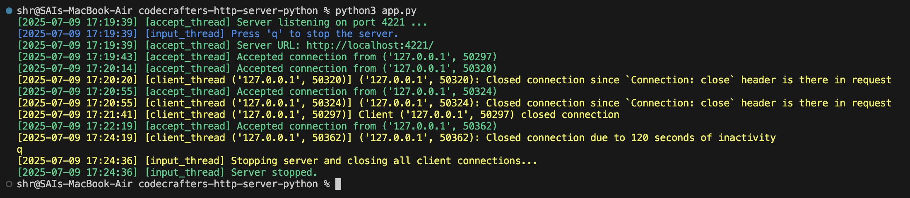
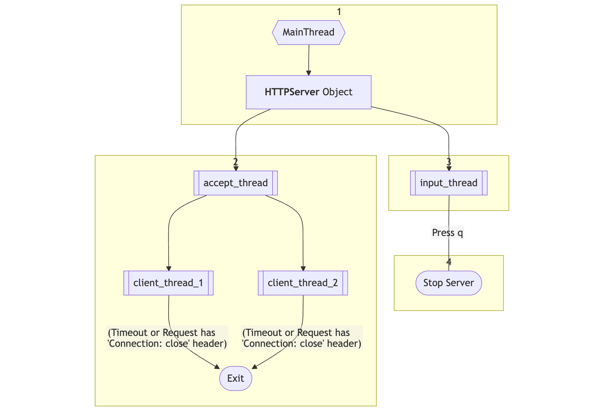

# TinyFlask



## Contents

1. [Features](#-features)
2. [Dependencies](#dependencies)
3. [Example Server](#example-server)
4. [Docs](#docs)

   * [4.1 Creating an API end point](#creating-an-api-end-point)
   * [4.2 Sending a response ](#sending-a-response)
   * [4.3 How it works ?](#how-it-works-)

---

A lightweight HTTP server **built from scratch** in Python with Flask-like routing, multithreading, dynamic URL parameters, gzip compression, and graceful shutdown.

### Features

* **Flask-style Routing**: Define endpoints using `@app.route(path, methods=["GET"])`
* **Dynamic URL Parameters**: e.g. `/files/tmp/{filename}`
* **Custom Request & Response Objects** for clean endpoint code
* **Multithreaded**: Each client is handled in a separate thread
* **Idle Timeout**: Closes inactive client connections after 2 minutes
* **Gzip Compression** (if `Accept-Encoding: gzip` is sent)
* **Graceful Shutdown**: Closes all sockets and threads by just pressing `q`

### Dependencies

No external dependencies required. Just Python 3.7+

### Example Server

```python
from tiny_flask.server import HTTPServer
from tiny_flask.request import Request
from tiny_flask.response import Response
import os

app = HTTPServer(port=4221) # Starts listening by default

@app.route('/')
def home(request: Request):
    return 'Welcome to the Tiny Flask server!'

@app.route('/echo/{string}')
def echo(request: Request, string):
    return string

@app.route('/user-agent')
def user_agent(request: Request):
    if "user-agent" in request.headers:
        return request.headers["user-agent"]
    else:
        response = Response(status_code=400, reason="Malformed Request")
        response.body = "The HTTP request sent is malformed and doen't contain user-agent header in it"
        return response

@app.route('files/{name}', methods=["GET"])
def send_file(request: Request, name: str):
    files_dir = "./tmp"
    file = os.path.join(files_dir, name)
    if os.path.isfile(file):
        data = ""
        with open(file, "rb") as f:
            data = f.read().decode()
        response = Response()
        # response.add_header("content-type", "application/octet-stream")
        response.body = data
        return response
    else:
        response = Response(status_code=500, reason="Not Found")
        response.body = "You're requesting for a file which does not exist on this server"
        return response

@app.route('files/{name}', methods=["POST"])
def send_file(request: Request, name: str):
    files_dir = "./tmp"
    file = os.path.join(files_dir, name)
    content = request.body
    with open(file, "wb") as f:
        f.write(content.encode())
    response = Response(status_code=201, reason="Created")
    response.body = "File created/overwritten successfully"
    return response
```

### Docs

#### Creating an API end point

Creating an end point using tiny flask is almost same as creating an end point in `Flask`. The only difference is tiny\_flask server class expects all end point handlers to have an argument named `request` of type `Request`

```python
from tiny_flask.server import HTTPServer
from tiny_flask.request import Request
from tiny_flask.response import Response
import os

app = HTTPServer(port=4221) # Starts listening by default

@app.route('/', methods=["GET"])
def home(request: Request): # request: Request argument is needed in all end point handlers
    return 'Welcome to the Tiny Flask server!'
```

#### Sending a response

`tinyflask` expects your API end point handlers to either return a string or a Response object. So there are 2 ways to return a response using `tinyflask`.

1. Just return a string.

   ```python
   @app.route('/', methods=["GET"])
   def home(request: Request): # request: Request argument is needed in all end point handlers
       return 'Welcome to the Tiny Flask server!'
   ```

   `TinyFlask` marks these type of responses as `200 OK` by default.
2. If you want to customise the response with desired status code / reason / headers then you can return an object of the `Response` class inside the handler.

   ```python
   @app.route('/user-agent')
   def user_agent(request: Request):
       if "user-agent" in request.headers:
           return request.headers["user-agent"]
       else:
           response = Response(status_code=400, reason="Malformed Request")
           response.body = "The HTTP request sent is malformed and doen't contain user-agent header in it"
           return response
   ```

**NOTE**

1. If the handler just returns a string then tinyflask adds the header `Content-Type: text/plain` by default
2. TinyFlask overides the `Content-Length` header value in response even if you specify it in the handler and calculates it using python's `len()` function before sending the response to server.

#### How it works ?

1. When you create an object of `HTTPServer` class the default constructor creates 2 threads, `accept_thread` to accept client connections and `input_thread` which blocks for user input from terminal.
2. Inside the `accept_thread` there is a while loop that runs as long as the server is running and whenever we receive a client connection we will create a `client_thread` for each connection.
3. Inside the `client_thread` there is while loop that receives data from client persistently unless the socket timeout is reached or the client sends a request with `Connection: close` header.



---

Built with ❤️ by [Sai Hemanth Reddy](https://www.linkedin.com/in/sai-hemanth-reddy/)
